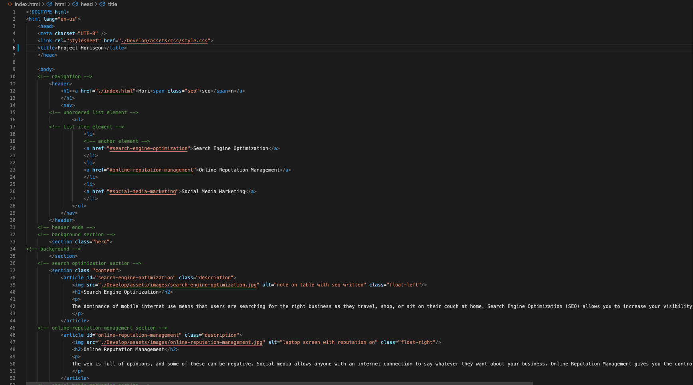
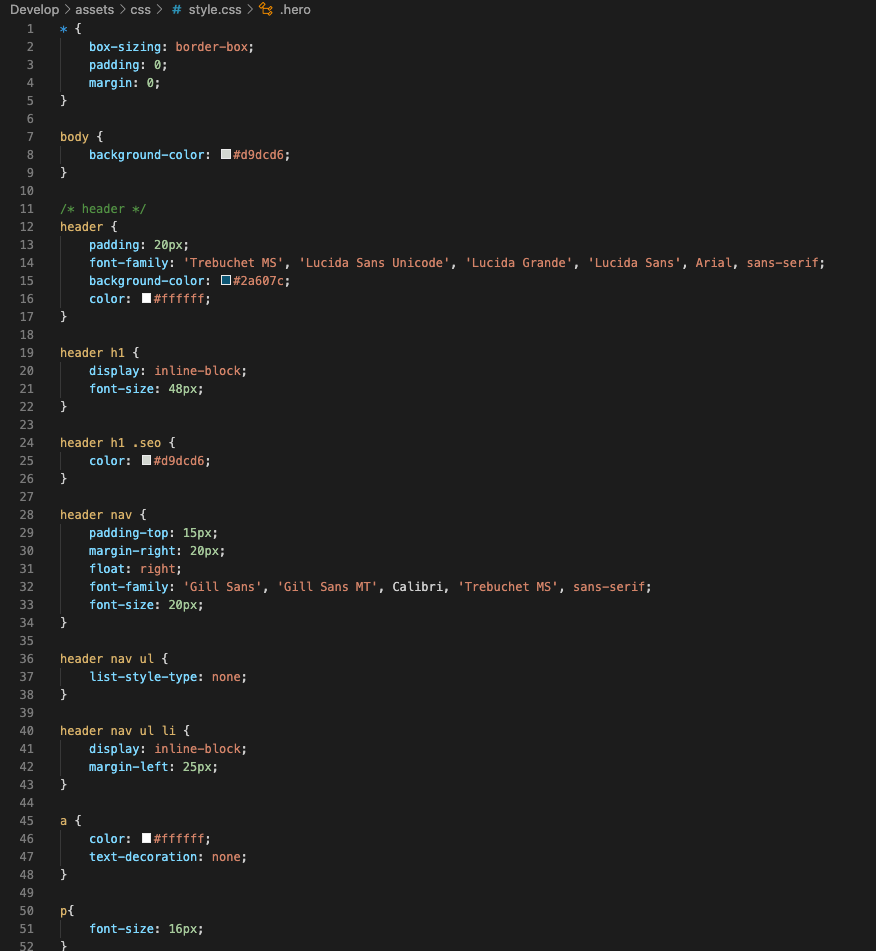
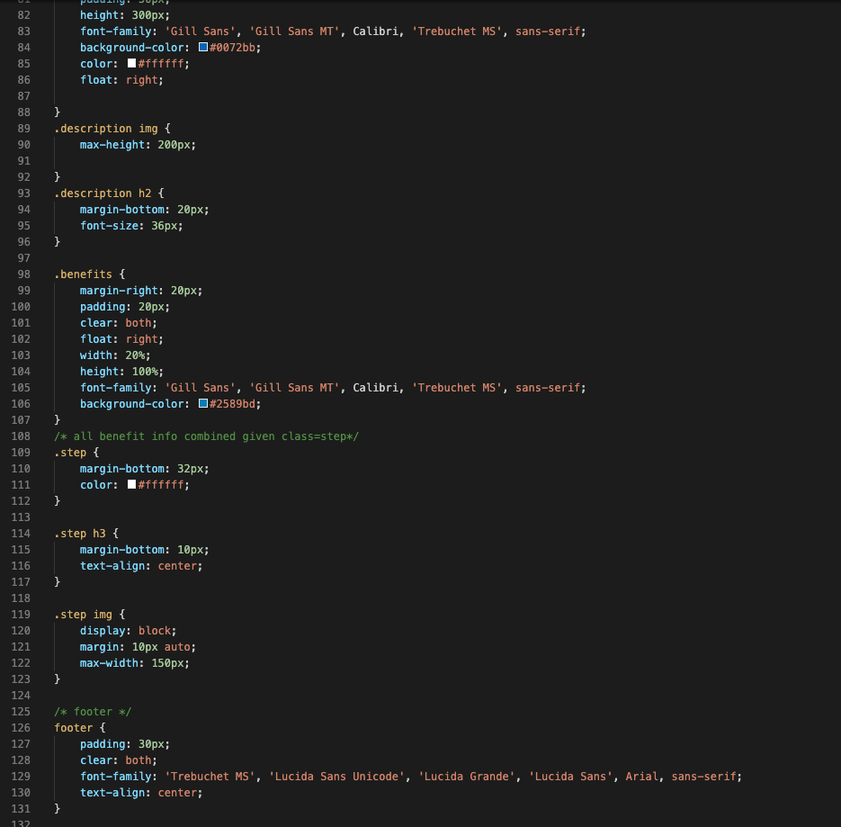

# 01 Challenge Horiseon


## Description 

Introducing new seach engine optimizer: Project Horiseon, is here to increase your web accessbility

To take a first step to become a junior Developer, I think it would be a great chance for me to Refactor what is already been wonderfully made. The website itself is already systemetically made however I can little help to make this optimizer to increase accessbility just little more

As I am refactoring I saw some of the Links and Attributes are not properly linked and selector and properies are not consolidated, yet some of them are easily recognizable. Doing all these works surely made me to chooes proper tags and selector and how they functions correctly. most importantly, how it is important to consolidated and refactoring.

## Table of Contents (Optional)

* [Usage](#usage)
* [Credits](#credits)
* [License](#license)

## Usage 

Here are some quick overview of what I have done 

<<<<<<< HEAD
```md



=======
>>>>>>> dcbbd73a080caa5c3eac1142d9c3016bbe383045


### Technology
    - html
    - css
    - git

## Credits

    - Richard Kim: richardyjkim (github)


## License

MIT License

Copyright (c) [2021] [Richard Y Kim]

Permission is hereby granted, free of charge, to any person obtaining a copy
of this software and associated documentation files (the "Software"), to deal
in the Software without restriction, including without limitation the rights
to use, copy, modify, merge, publish, distribute, sublicense, and/or sell
copies of the Software, and to permit persons to whom the Software is
furnished to do so, subject to the following conditions:

The above copyright notice and this permission notice shall be included in all
copies or substantial portions of the Software.

THE SOFTWARE IS PROVIDED "AS IS", WITHOUT WARRANTY OF ANY KIND, EXPRESS OR
IMPLIED, INCLUDING BUT NOT LIMITED TO THE WARRANTIES OF MERCHANTABILITY,
FITNESS FOR A PARTICULAR PURPOSE AND NONINFRINGEMENT. IN NO EVENT SHALL THE
AUTHORS OR COPYRIGHT HOLDERS BE LIABLE FOR ANY CLAIM, DAMAGES OR OTHER
LIABILITY, WHETHER IN AN ACTION OF CONTRACT, TORT OR OTHERWISE, ARISING FROM,
OUT OF OR IN CONNECTION WITH THE SOFTWARE OR THE USE OR OTHER DEALINGS IN THE
SOFTWARE.

© 2021 Trilogy Education Services, LLC, a 2U, Inc. brand. Confidential and Proprietary. All Rights Reserved.
